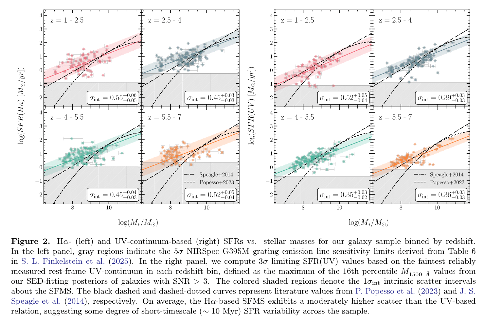
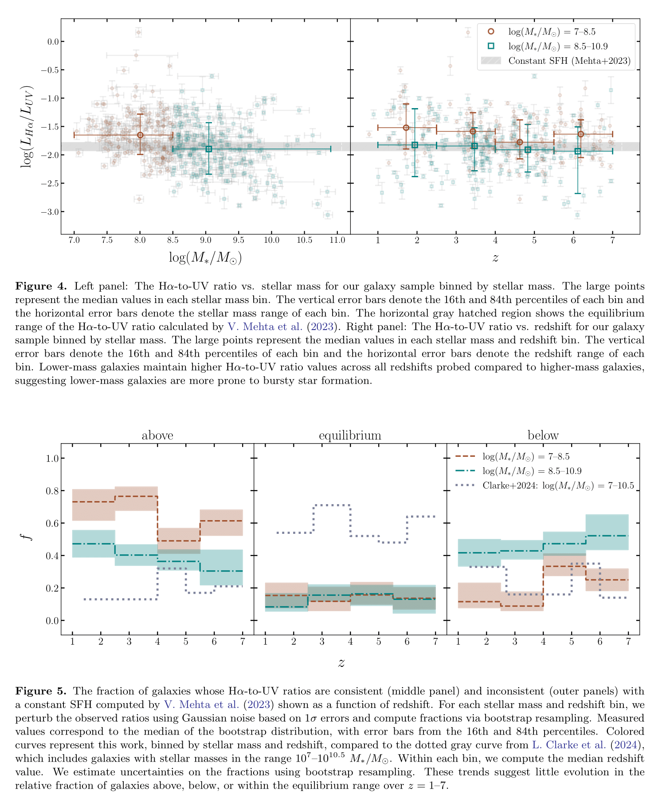

# The Prevalence of Burst Star Formation in Low-Mass Galaxies in the Early Universe

(https://sites.utexas.edu/vip/)

* Project at the University of Texas at Austin within the Galaxy Evolution Vertically Integrated Project (GEVIP) research group !
* Measure the burstiness of ~350 galaxies at $z \leq 7$ using JWST NIRSpec data.
* This project is motivated by recent work that suggests the potential stochasticity of star formation in the early universe (Ciesla+2024; Cole+2025).
* To measure the burstiness of galaxies across cosmic time, I analyze the residual $H\alpha$- and UV-continuum-based star-formation rates from the star forming main sequence curve as well as the timescale of star formation events as traced by the $H\alpha$-to-UV ratio.

## Work is Submitted to ApJ and was Presented at UT Austin's Cosmic Frontier Center Conference (May, 2025)

